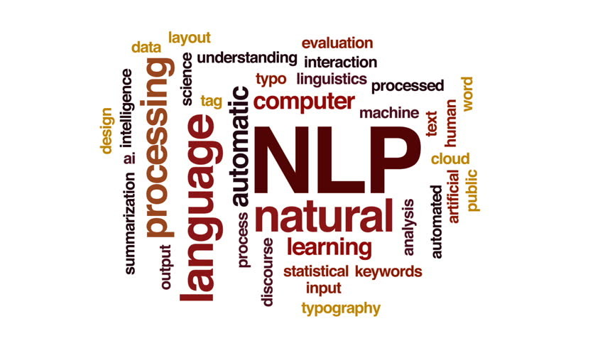

# NLP for Customer Insights: A Deep Dive into Women's Clothing Reviews

---

This project presents a comprehensive case study on Women's E-Commerce Clothing Reviews, focusing on two key areas: Sentiment Analysis and Predictive Modeling. The primary objective was to extract actionable insights from unstructured text data to understand customer sentiment and predict how a product might be rated based on the language of the review.

## Sentiment Analysis
Conducted a comparative sentiment analysis using multiple popular NLP libraries:

- **spaCy**: Leveraged for its powerful linguistic features and text processing capabilities to prepare the data for analysis.

- **TextBlob**: Employed for its straightforward and accessible API to get polarity and subjectivity scores.

- **NLTK's VADER (Valence Aware Dictionary and sEntiment Reasoner)**: Utilized for its effectiveness on social media and short, informal text, which is common in reviews.

---

## WordCloud Analysis
* The Positive WordCloud visually confirmed that attributes like *fit*, *comfort*, *color*, and *quality* (using words like 'love', 'perfect', 'great', 'soft', 'beautiful') are key drivers of high ratings. 

* In stark contrast, the Negative WordCloud immediately highlighted significant customer pain points, with words like *small*, *tight*, *cheap*, *return*, and *disappointed* being most prominent.

---

## Predictive Analysis
1. **Text Preprocessing & Feature Engineering**: Cleaned and prepared the text data. Utilized TF-IDF Vectorizer to convert the corpus of reviews into a meaningful matrix of numerical features, giving weight to words that are more important to a specific review.
   
3. **Data Visualization**: Generated WordClouds for different sentiment categories to visually identify the most frequent and prominent words associated with positive and negative feedback
   
5. **Model Building**: Implemented a Logistic Regression model, a robust and interpretable classification algorithm, to predict the sentiment or star rating of a review. The model was trained on the TF-IDF features to learn the patterns in the language that correlate with customer satisfaction.

